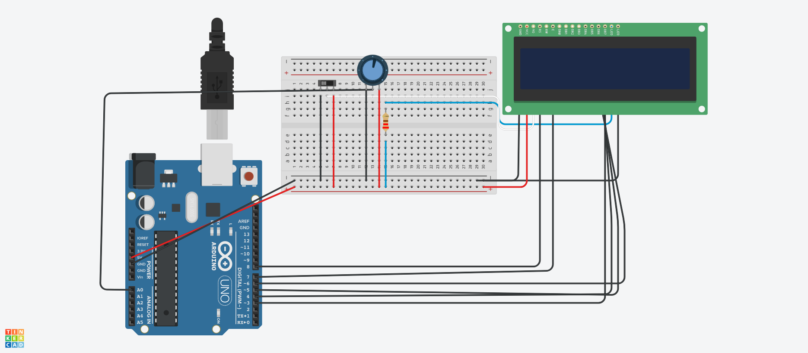

# Flappy Bird

1 HERE WE TAKE OBSTAKLE AS STRINGS THEN WE TAKE OUT POSITION OF ALL THE * AND STORE IT INTO TYPEA AND TYPE AA FOR ABOVE AND THE BELOW LINE OF THE GAME DISPLAYED INN THE LCD.

2 THEN WE TAKE INPUT FROM A0, FROM POTENTIOMETER

3 THEN WE CONVERT THE ANALOG SIGNALS FROM POTENTIOMETER TO DIGITAL  SIGNAL BY SETTING THE SENSORVALUE TO 500(HALF) AS HIGHESDT VALUE WAS 1023

4 THEN WE CONTROL THE CARACTER IMAGE WITH THE SENSOR VALUE

5 THEN TERE IS REST OF CODE FOR THE GAME TO RUN, LIKE PRINTING ON LCD AND IF THE CARACTERS POSITION MATCHES WITH THE OBSTACLE POSITION THE THE GAME IS OVER
https://www.tinkercad.com/things/gMDfwOuJ0Hw-copy-of-flappy-bird/editel?tenant=circuits